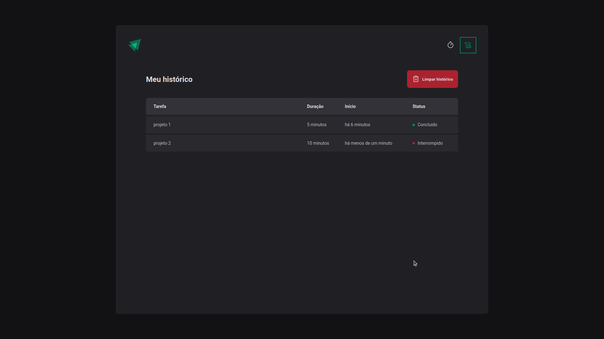

# Awesome Timer
## Um timer útil para gerenciar tarefas facilmente.

## Sobre
Este timer é um projeto pessoal desenvolvido para aprender e aplicar novas funcionalidades do ReactJs utilizando o framework NextJs.

Com ele consegui me aprofundar mais na utilização do Context Hook do React combinado com Reducers e Actions para controlar os estados no ciclo de vida dos componentes.

## Features

- [x] Criação do timer
- [x] Histórico de tarefas com status
- [ ] Gerenciamento individual das tarefas

## Tecnologias

As seguintes ferramentas foram usadas na construção do projeto:

- [TypeScript](https://www.typescriptlang.org/)
- [NextJs](https://nextjs.org/)
- [ReactJs](https://pt-br.reactjs.org/)

## Screenshots




## Pré-requisitos

Antes de começar, você vai precisar ter instalado em sua máquina as seguintes ferramentas:
[Git](https://git-scm.com), [Node.js](https://nodejs.org/en/) e [Yarn](https://yarnpkg.com/)

```bash
# Clone este repositório
$ git clone https://github.com/mvsmoreira/awesome-timer.git

# Acesse a pasta do projeto no terminal/cmd
$ cd awesome-timer

# Instale as dependências
$ yarn

# Execute a aplicação em modo de desenvolvimento
$ yarn dev

# O servidor inciará na porta:3000 - acesse <http://localhost:3000>
```
